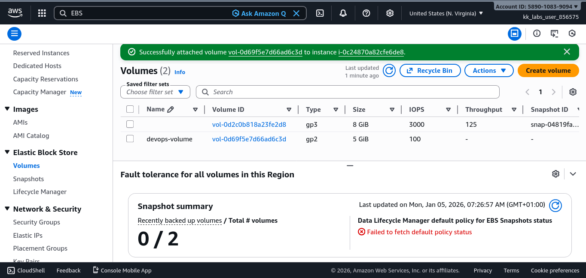
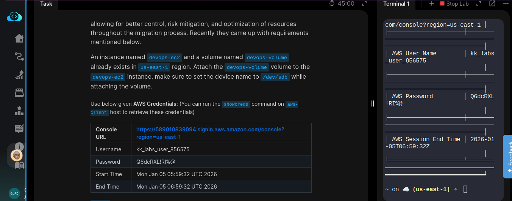
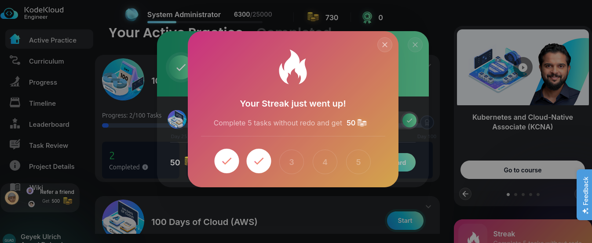

# Day 12/100

## Task
The Nautilus DevOps team has been creating a couple of services on AWS cloud. They have been breaking down the migration into smaller tasks, allowing for better control, risk mitigation, and optimization of resources throughout the migration process. Recently they came up with requirements mentioned below.

An EC2 instance named `devops-ec2` and an EBS volume named `devops-volume` already exist in the `us-east-1` region.  
Attach the `devops-volume` to the `devops-ec2` instance and set the device name to `/dev/sdb` during attachment.

---

## Task Description
Today, I attached an existing **EBS volume** (`devops-volume`) to an existing **EC2 instance** (`devops-ec2`).  
At first, the device naming (`/dev/sdb`) was a bit confusing, especially understanding how AWS maps device names at the OS level. I reviewed AWS documentation and verified the attachment process carefully before completing the task.

This hands-on exercise helped me clearly understand how storage can be dynamically attached to running instances in the cloud.

---

## Key Feature
**EBS Volume Attachment**

Important points:
- EBS volumes can be attached and detached without recreating instances
- Device names like `/dev/sdb` define how the volume is exposed to the operating system
- Enables flexible storage management during scaling or maintenance

---

## Key Takeaway
Cloud storage is not static. Volumes can be attached, detached, and reused as needed, which makes infrastructure more flexible and resilient compared to traditional physical servers. This task reinforced how cloud resources are designed for change.

---

## Screenshot
_Successfully Attached EBS volume to an EC2 instance:_  

---
_Task details:_

---
_shoutout on completion:_
