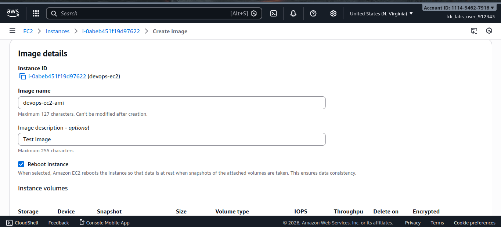
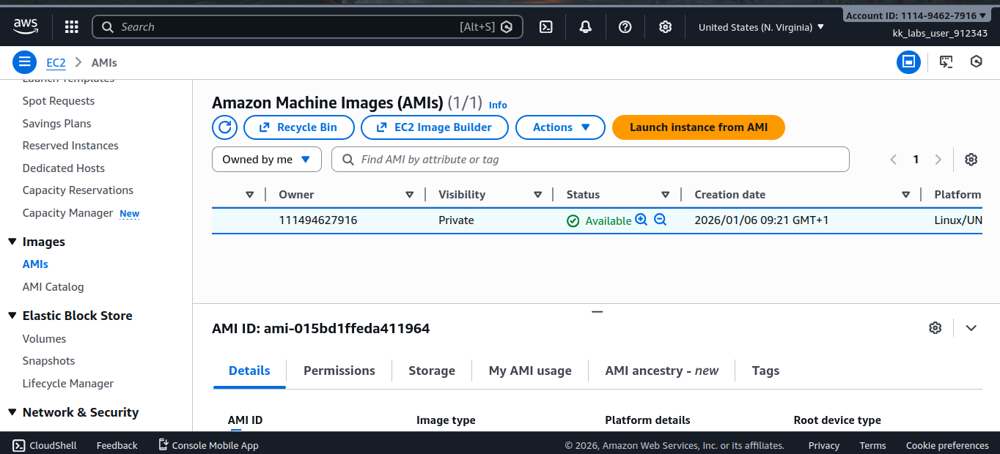
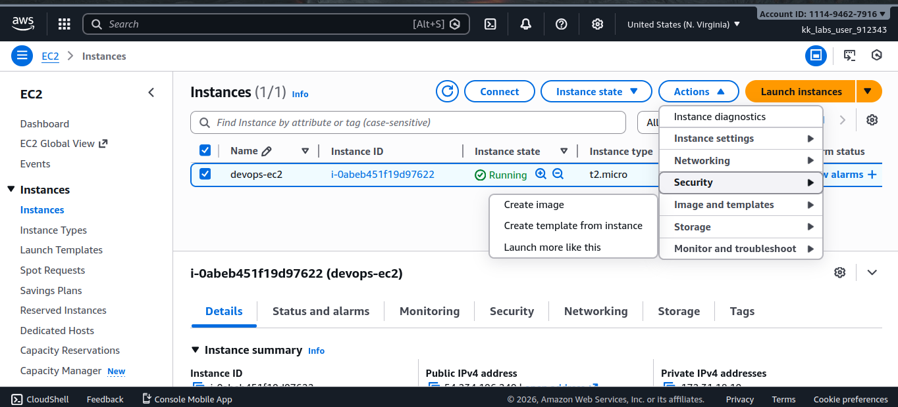
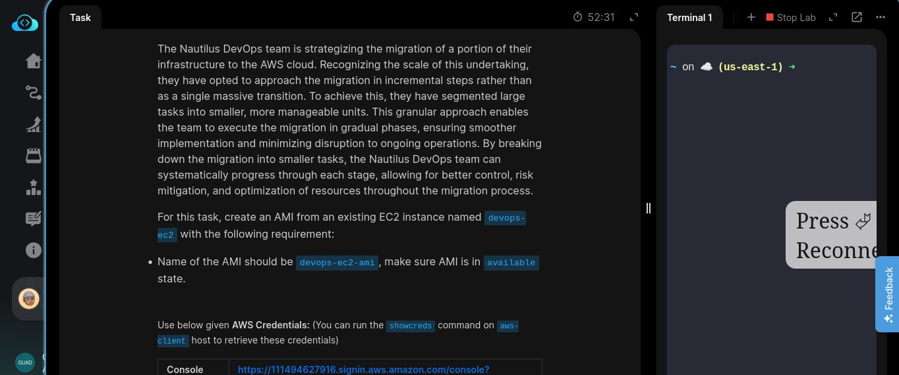

# Day 13/100 — Creating an AMI from an EC2 Instance

## Task
The Nautilus DevOps team is strategizing the migration of a portion of their infrastructure to the AWS cloud. Recognizing the scale of this undertaking, they have opted to approach the migration in incremental steps rather than as a single massive transition.

To achieve this, they have segmented large tasks into smaller, more manageable units. This granular approach enables the team to execute the migration in gradual phases, ensuring smoother implementation and minimizing disruption to ongoing operations.

For this task, create an **Amazon Machine Image (AMI)** from an existing EC2 instance with the following requirements:

- Source EC2 instance name: `devops-ec2`
- AMI name: `devops-ec2-ami`
- Ensure the AMI reaches the **Available** state

---

## Task Description
Today, I worked on creating an **AMI (Amazon Machine Image)** from an existing EC2 instance (`devops-ec2`).

At first, it wasn’t entirely obvious what happens behind the scenes when an AMI is created. I had to slow down, read through AWS documentation, and observe the different AMI states (`pending` → `available`). Understanding that the instance data, root volume, and configuration are captured together helped clarify the concept.

This task reinforced how AMIs act as reusable blueprints for infrastructure in the cloud.

---

## Key Feature
**Amazon Machine Image (AMI)**

Important points:
- An AMI is a template that contains:
  - The operating system
  - Application configurations
  - Attached storage snapshots
- AMIs allow you to launch **identical EC2 instances** repeatedly
- The `Available` state confirms the AMI is ready for use

---

## Key Takeaway
AMIs are a core building block for scalability and reliability in AWS. Instead of configuring servers from scratch, you can capture a working system once and reuse it many times. This task highlighted how cloud infrastructure favors repeatability, speed, and consistency over manual setup.

---

## Screenshots
_ALl Images from today's task:_

  _AMI Creation Process:_

---
_AMI Status Available:_

---
_Source EC2 Instance:_

---
_AMI Details Page:_

