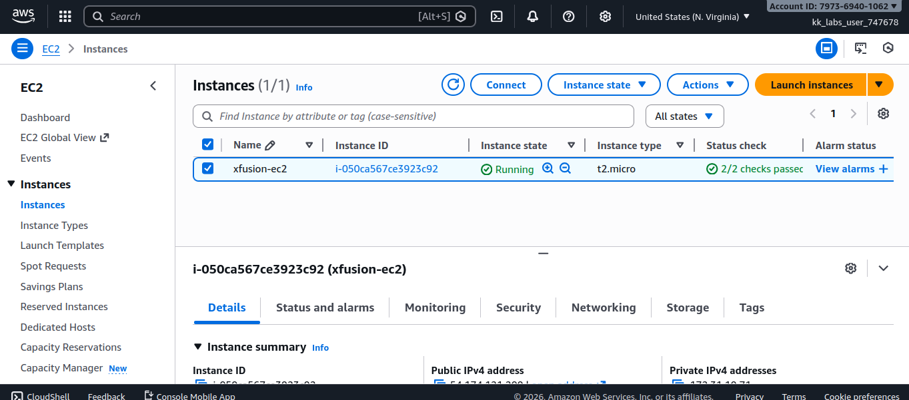
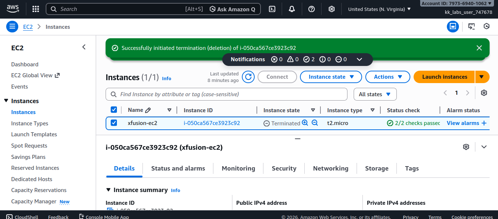
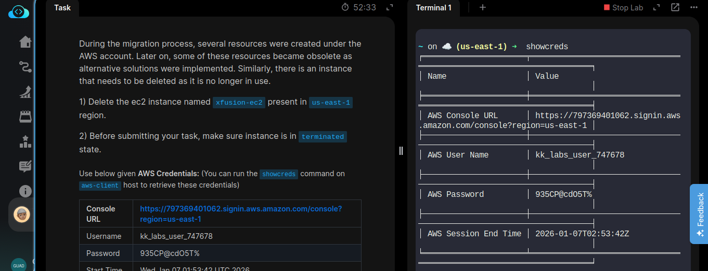
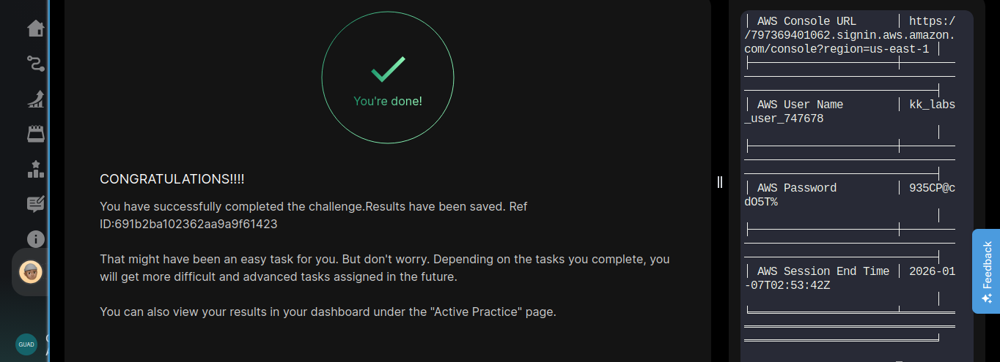

# Day 14/100

## Task
During the migration process, several AWS resources were created. Over time, some of these resources became obsolete as alternative solutions were implemented. To keep the environment clean and optimized, an unused EC2 instance needed to be removed.

**Requirements:**
- Delete the EC2 instance named `xfusion-ec2`
- Ensure the instance is in the **terminated** state
- Region: `us-east-1`

---

## Task Description
Today, I identified an unused **EC2 instance** (`xfusion-ec2`) and safely **terminated** it.  
Before submitting the task, I verified that the instance had fully transitioned to the **terminated state**, confirming it was completely removed and no longer consuming resources.

This task reinforced the importance of managing the full lifecycle of cloud resources, not just creating them.

---

## Key Feature
**EC2 Instance Termination**

Important points:
- Terminated instances are permanently deleted and cannot be recovered
- Prevents unnecessary costs from unused resources
- Helps maintain a clean and secure AWS environment

---

## Key Takeaway
Cloud optimization is not only about scaling resources up, but also about knowing **when to clean up**.  
Regularly reviewing and removing unused resources reduces cost, improves security, and keeps infrastructure efficient.

---

## Screenshot

_Available EC2 Instance :_

---

_Successfully terminated EC2 instance:_  

---

_Task details:_  

---
_Terminated State:_

---

_shoutout on completion:_  

