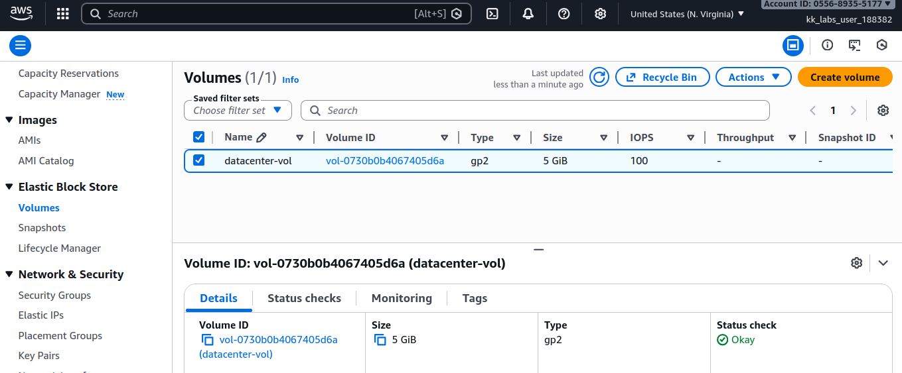
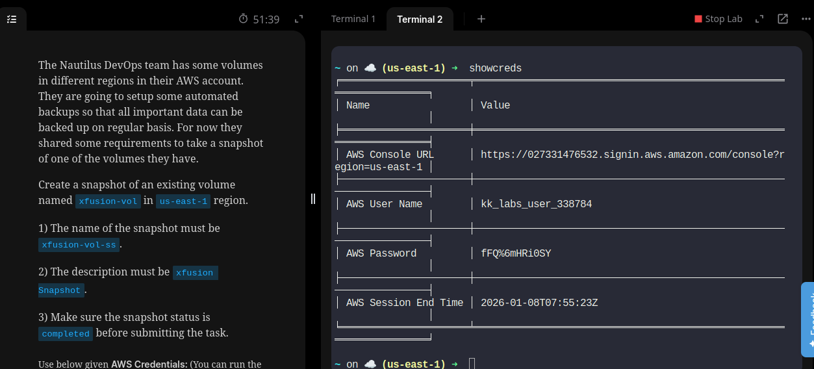

# Day 15/100

## Task
The Nautilus DevOps team is preparing to implement automated backups to ensure important data is protected across their AWS infrastructure. As part of this process, a snapshot needed to be created from an existing EBS volume.

**Requirements:**
- Create a snapshot of the volume named `datacenter-vol`
- Snapshot name: `datacenter-vol-ss`
- Snapshot description: `datacenter Snapshot`
- Ensure the snapshot status is **completed**
- Region: `us-east-1`

---

## Task Description
Today, I created an **EBS snapshot** from an existing volume (`datacenter-vol`).  
After selecting the correct region and volume, I added the required name and description, then waited until the snapshot status changed from **pending** to **completed** before submitting the task.

This hands-on task helped me better understand how backups are handled in the cloud and why snapshots are essential for data protection.

---

## Key Feature
**EBS Snapshot**

Important points:
- EBS snapshots are point-in-time backups of volumes
- They are stored securely and can be used to restore data when needed
- Snapshots form the foundation of backup and disaster recovery strategies

---

## Key Takeaway
Cloud backups are simple, fast, and reliable.  
With snapshots, data protection no longer requires complex physical processes. This task highlighted how the cloud makes backup and recovery efficient and scalable.

---

## Screenshot

_Available EBS Volume:_  

---

_Snapshot creation in progress:_  

---

_Successfully completed snapshot:_  

---

_Task details:_  

---

_shoutout on completion:_  

