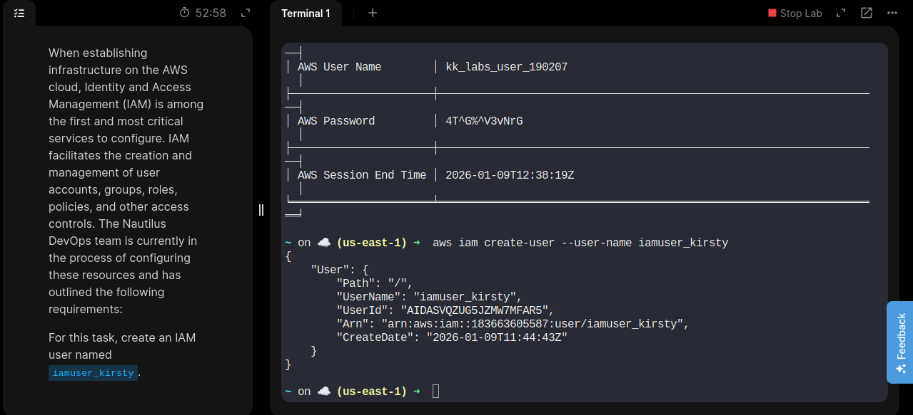
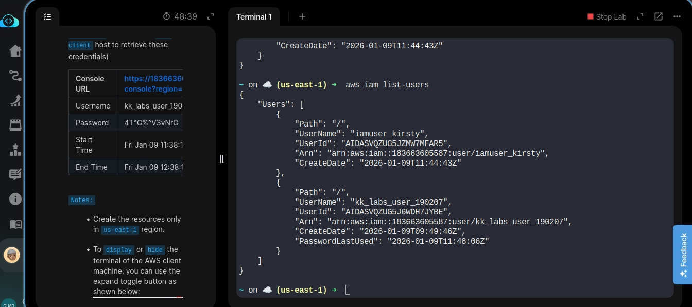
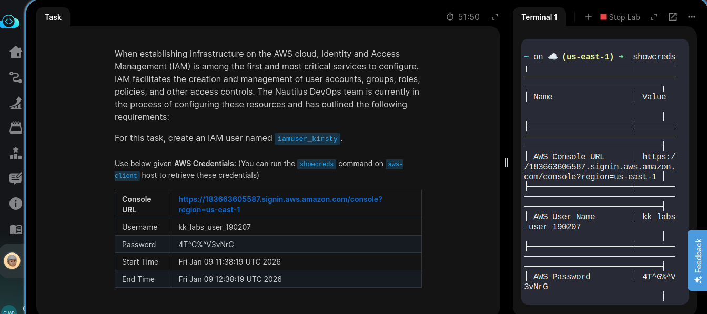
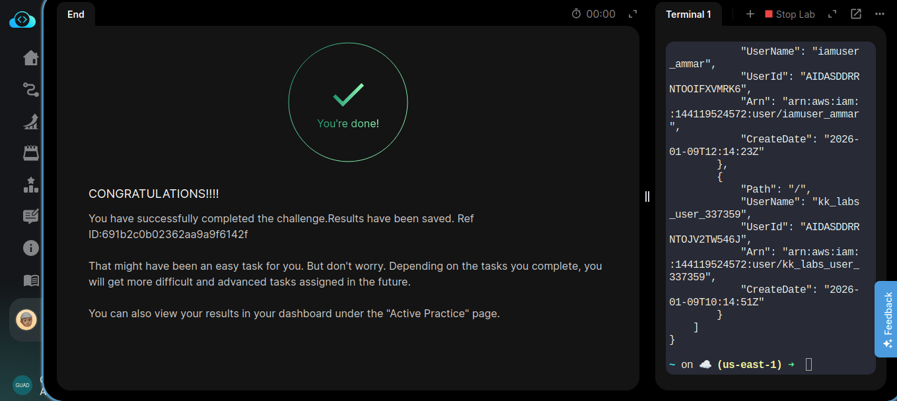
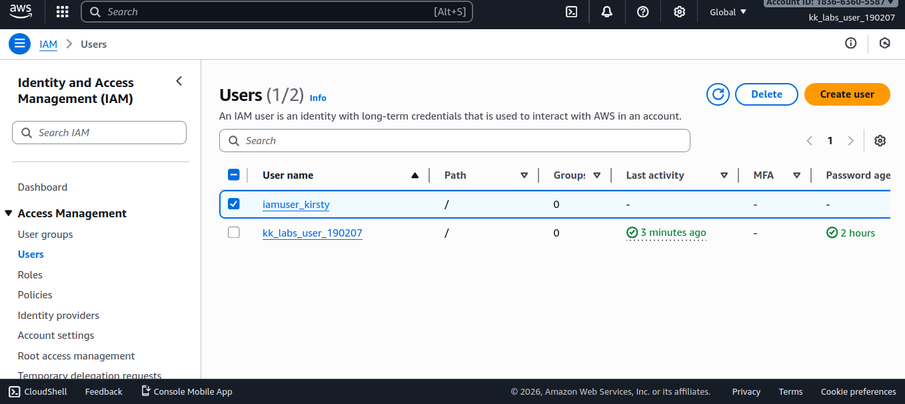

# Day 16/100

## Task
When establishing infrastructure on AWS, **Identity and Access Management (IAM)** is one of the first and most critical services to configure. IAM helps control who can access AWS resources and what actions they are allowed to perform.

For this task, the Nautilus DevOps team required the creation of a new IAM user with the following requirement:

- Create an IAM user named `iamuser_kirsty`
- Region: `us-east-1`
- Use AWS-provided credentials

---

## Task Description
Today, I worked with **AWS IAM** to create a new IAM user named `iamuser_kirsty`.  
This task focused on understanding how AWS manages identities and access at a foundational level.

By creating the user, I reinforced how IAM serves as the entry point for securing AWS environments. Every service, action, and permission in AWS depends on IAM, which makes it a critical component of any cloud setup.

This exercise also highlighted how IAM users are typically created first before assigning permissions, roles, or group memberships.

---

## Key Feature
**AWS Identity and Access Management (IAM)**

Important points:
- IAM manages users, groups, roles, and policies
- IAM users represent individual people or applications
- Permissions define what actions users can perform
- Helps enforce security best practices like least privilege
- IAM is global, but tasks are often organized by region for consistency

---

## Key Takeaway
IAM is the foundation of cloud security. Before deploying compute, storage, or networking resources, access control must be clearly defined. Creating IAM users correctly ensures secure, organized, and scalable cloud environments.

Consistent daily practice continues to strengthen my understanding of AWS fundamentals and real-world DevOps workflows.

---

## Screenshot
_Successfully created IAM user:_  

---

_Total user available after creation :_  

---

_Task details:_  

---

_shoutout on completion:_  

---

_Created user available on console:_  

