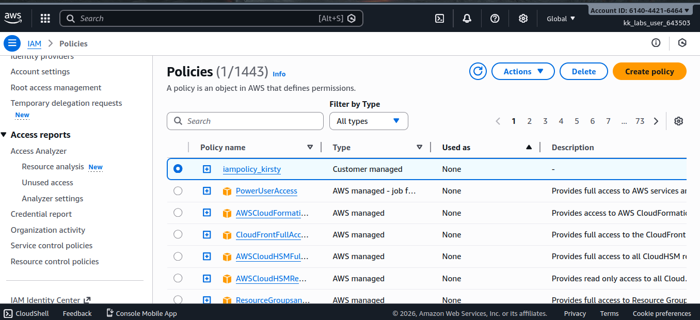
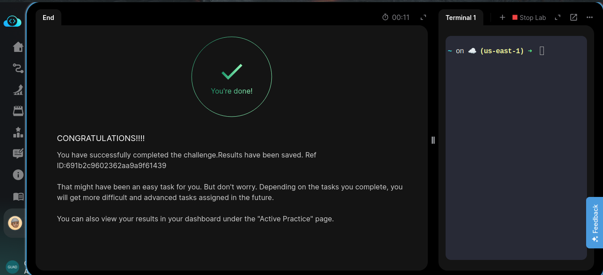

# Day 18/100 — Creating an IAM Policy for EC2 Read-Only Access Using AWS CLI

## Task Description
When establishing infrastructure on the AWS cloud, Identity and Access Management (IAM) is among the first and most critical services to configure. IAM facilitates the creation and management of user accounts, groups, roles, policies, and other access controls. The Nautilus DevOps team is currently in the process of configuring these resources and has the following requirements.

Create an IAM policy named `iampolicy_kirsty` in us-east-1 region, it must allow read-only access to the EC2 console, i.e. the policy must allow users to view all instances, AMIs, and snapshots in the Amazon EC2 console.

**AWS Credentials Provided:**
- Region: us-east-1
- Username: kk_labs_user_643503
- Password: H0BEspCS!W9t
- Start Time: Sun Jan 11 06:55:34 UTC 2026
- End Time: Sun Jan 11 07:55:34 UTC 2026

---

## What I Explored and Learned

### Understanding IAM Policies
IAM Policies are JSON documents that define permissions in AWS. They specify what actions are allowed or denied on which resources. This task helped me understand:

- **Policy Structure**: How to create a properly formatted JSON policy document
- **EC2 Permissions**: Specific actions needed for read-only access to EC2 resources
- **Resource Scoping**: How to define which resources the policy applies to
- **Policy Attachment**: How policies connect to users, groups, or roles

### Key Terms Explained
- **IAM Policy**: A JSON document that defines permissions in AWS
- **Read-Only Access**: Permissions that allow viewing but not modifying resources
- **EC2 Console**: The AWS web interface for managing Amazon Elastic Compute Cloud
- **Instances**: Virtual servers in the AWS cloud
- **AMIs (Amazon Machine Images)**: Templates that contain software configurations
- **Snapshots**: Point-in-time backups of EBS volumes
- **Actions**: Specific operations that can be performed on AWS resources
- **Resources**: AWS entities that can be acted upon (instances, volumes, etc.)

### Use Cases and Why IAM Policies Matter
IAM Policies are essential in cloud environments for several reasons:

1. **Security**: Control who can access what resources and what they can do
2. **Compliance**: Meet regulatory requirements by restricting access appropriately
3. **Operational Efficiency**: Grant only necessary permissions to users
4. **Risk Mitigation**: Prevent accidental or malicious resource modifications
5. **Audit Trail**: Track who has access to what resources

### Real-World Applications
In enterprise environments, IAM policies are used to:
- Grant developers read-only access to production resources for troubleshooting
- Provide auditors access to view resources without allowing changes
- Enable monitoring systems to collect data without modifying resources
- Implement the principle of least privilege across the organization

---

## Commands Used

### Step 1: Create the Policy Document
First, I created a JSON policy document with the required permissions:

```json
{
    "Version": "2012-10-17",
    "Statement": [
        {
            "Effect": "Allow",
            "Action": [
                "ec2:Describe*",
                "ec2:List*",
                "ec2:Get*"
            ],
            "Resource": "*"
        }
    ]
}
```

### Step 2: Create the IAM Policy
```bash
aws iam create-policy --policy-name iampolicy_kirsty --policy-document file://policy.json
```

### Command Breakdown
- `aws`: The AWS Command Line Interface executable
- `iam`: Specifies the AWS service (Identity and Access Management)
- `create-policy`: The specific IAM operation to perform
- `--policy-name iampolicy_kirsty`: Parameter specifying the name of the policy
- `--policy-document file://policy.json`: Parameter specifying the path to the JSON policy document

### Alternative Inline Policy Creation
```bash
aws iam create-policy --policy-name iampolicy_kirsty --policy-document '{"Version":"2012-10-17","Statement":[{"Effect":"Allow","Action":["ec2:Describe*","ec2:List*","ec2:Get*"],"Resource":"*"}]}'
```

### Verification Commands
```bash
# List all IAM policies to verify creation
aws iam list-policies

# View details of the specific policy
aws iam get-policy --policy-arn arn:aws:iam::691595780564:policy/iampolicy_kirsty

# Get the policy version details
aws iam get-policy-version --policy-arn arn:aws:iam::691595780564:policy/iampolicy_kirsty --version-id v1
```

### Additional Policy Management Commands
```bash
# Attach the policy to a user
aws iam attach-user-policy --user-name <username> --policy-arn arn:aws:iam::691595780564:policy/iampolicy_kirsty

# Attach the policy to a group
aws iam attach-group-policy --group-name <groupname> --policy-arn arn:aws:iam::691595780564:policy/iampolicy_kirsty

# Detach the policy from a user
aws iam detach-user-policy --user-name <username> --policy-arn arn:aws:iam::691595780564:policy/iampolicy_kirsty

# Delete the policy (only if detached from all users/groups/roles)
aws iam delete-policy --policy-arn arn:aws:iam::691595780564:policy/iampolicy_kirsty
```

---

## Step-by-Step Guide for Others

### Prerequisites
- AWS CLI installed and configured
- Valid AWS credentials with IAM permissions
- Basic understanding of AWS IAM concepts
- Text editor to create JSON policy document

### Steps to Complete the Task

1. **Create the Policy Document**:
   Create a file named `policy.json` with the following content:
   ```json
   {
       "Version": "2012-10-17",
       "Statement": [
           {
               "Effect": "Allow",
               "Action": [
                   "ec2:Describe*",
                   "ec2:List*",
                   "ec2:Get*"
               ],
               "Resource": "*"
           }
       ]
   }
   ```

2. **Run the create-policy command**:
   ```bash
   aws iam create-policy --policy-name iampolicy_kirsty --policy-document file://policy.json
   ```

3. **Verify the policy was created**:
   ```bash
   aws iam list-policies
   ```

4. **Check the specific policy details**:
   ```bash
   aws iam get-policy --policy-arn arn:aws:iam::691595780564:policy/iampolicy_kirsty
   ```

### Common Issues and Solutions
- **Permission errors**: Ensure your IAM user has the necessary permissions to create policies
- **Invalid JSON format**: Validate your policy document using a JSON validator
- **CLI not configured**: Run `aws configure` to set up your credentials
- **Policy name conflicts**: Ensure the policy name is unique in your account

---

## Key Takeaways

1. **Security Best Practices**: Understanding the principle of least privilege and read-only access
2. **Policy Structure**: Learning the JSON format required for IAM policies
3. **EC2 Permissions**: Identifying the specific actions needed for read-only EC2 access
4. **Automation**: Using CLI for consistent and repeatable policy creation
5. **Scalability**: How policies can be applied to multiple users or groups efficiently

---

## My Learning Journey Reflection

### What Went Well
- Successfully created the IAM policy with the correct permissions for EC2 read-only access
- Understood the relationship between policy actions and EC2 resources
- Experienced the efficiency of CLI over GUI for policy management
- Applied security best practices by limiting access to read-only

### Challenges Encountered
- Initially had to research the specific EC2 actions needed for read-only access
- Had to ensure the JSON policy document was properly formatted

---

## Screenshots

_Policy creation successful:_


_Available on console:_


_Task completion verification:_


---

## Summary
Creating an IAM policy for EC2 read-only access was an excellent exercise in understanding AWS security fundamentals. This task reinforced the importance of granular permissions and highlighted how policies can be used to implement security best practices. The hands-on experience with CLI commands and JSON policy documents builds confidence for more complex AWS operations and sets a foundation for Infrastructure as Code practices.

Understanding IAM policies is crucial for anyone working with AWS, as they form the backbone of access control strategies in cloud environments. This knowledge will be invaluable as I progress to more advanced AWS security concepts and real-world implementations.