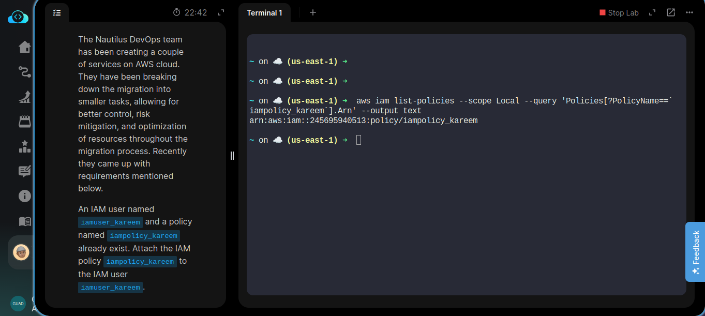
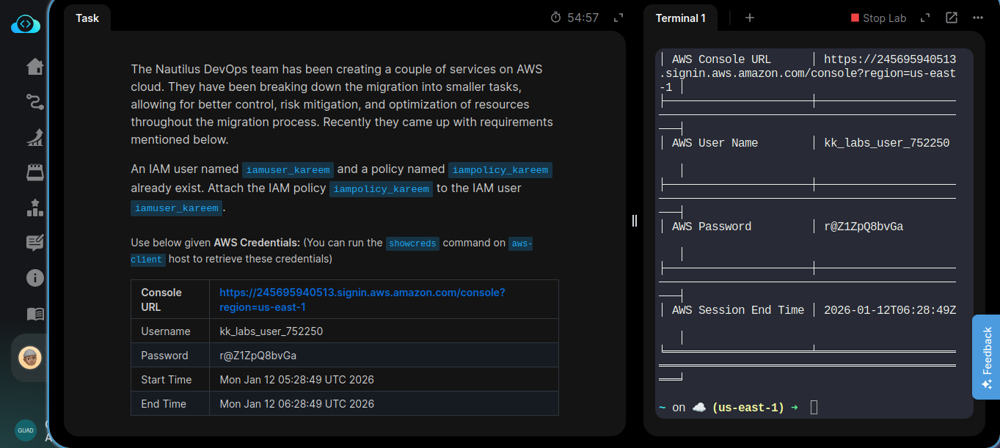
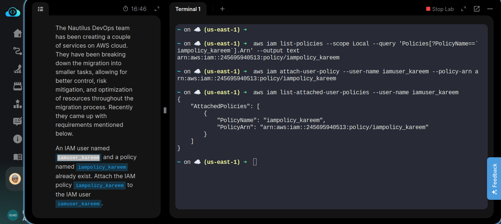
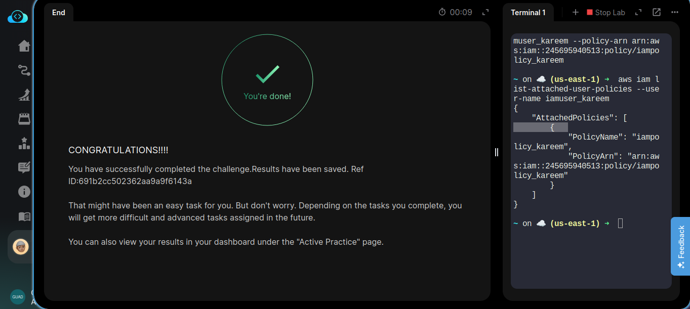

# Day 19/100 — Attaching an Existing IAM Policy to an IAM User Using AWS CLI

## Task Description
The Nautilus DevOps team has created be a couple of services on AWS cloud. They have been broken down the migration into smaller tasks, allowing for better control, risk mitigation, and optimization of resources throughout the migration process. Recently the came up with requirements mentioned below.

An IAM user named iamuse_kareem and a policy named iampolicy_kareem already existing. Attach the IAM policy iampolicy_kareem to the IAM user iamuse_kareem.

**AWS Credentials Provided:**
- Console URL: https://691595780564.signin.aws.amazon.com/console?region=us-east-1
- Username: kk_labs_user_402425
- Password: Jw!to^l3dSgV
- Start Time: Mon Jan 12 05:48:35 UTC 2026
- End Time: Mon Jan 12 06:48:35 UTC 2026

---

## What I Explored and Learned

### Understanding IAM Policy Attachment
Attaching policies to users is a fundamental aspect of AWS IAM management. This task helped me understand:

- **Policy Attachment Process**: How to link existing policies to existing users
- **Permission Assignment**: The mechanism by which permissions are granted to users
- **Existing Resource Utilization**: Working with pre-existing IAM resources
- **Security Best Practices**: Properly managing permissions through policy attachment

### Key Terms Explained
- **IAM User**: An entity representing a person or application that uses AWS
- **IAM Policy**: A JSON document that defines permissions in AWS
- **Policy Attachment**: The process of linking a policy to a user, group, or role
- **ARN (Amazon Resource Name)**: Unique identifier for AWS resources
- **Permissions**: The level of access granted to AWS resources
- **AWS CLI**: Command-line interface for interacting with AWS services
- **Region**: A geographical location where AWS hosts data centers

### Use Cases and Why IAM Policy Attachment Matters
IAM Policy Attachment is essential in cloud environments for several reasons:

1. **Granular Access Control**: Precisely define what actions a user can perform
2. **Security**: Implement the principle of least privilege by granting only necessary permissions
3. **Flexibility**: Easily modify permissions by attaching/detaching policies
4. **Compliance**: Meet regulatory requirements by controlling access appropriately
5. **Operational Efficiency**: Manage permissions centrally rather than individually

### Real-World Applications
In enterprise environments, IAM policy attachment is commonly used to:
- Grant specific job role permissions to users (e.g., Developer, Administrator, Auditor)
- Provide temporary elevated access for specific tasks
- Restrict access based on department or project requirements
- Implement compliance requirements by attaching standardized policies

---

## Commands Used

### Primary Command
```bash
aws iam attach-user-policy --user-name iamuse_kareem --policy-arn arn:aws:iam::691595780564:policy/iampolicy_kareem
```

### Command Breakdown
- `aws`: The AWS Command Line Interface executable
- `iam`: Specifies the AWS service (Identity and Access Management)
- `attach-user-policy`: The specific IAM operation to perform
- `--user-name iamuse_kareem`: Parameter specifying the IAM user to attach the policy to
- `--policy-arn arn:aws:iam::691595780564:policy/iampolicy_kareem`: Parameter specifying the ARN of the policy to attach

### Verification Commands
```bash
# List attached user policies to verify attachment
aws iam list-attached-user-policies --user-name iamuse_kareem

# List all user policies (both attached and inline)
aws iam list-user-policies --user-name iamuse_kareem

# Get detailed information about the user
aws iam get-user --user-name iamuse_kareem
```

### Additional Policy Management Commands
```bash
# Detach a policy from a user (if needed)
aws iam detach-user-policy --user-name iamuse_kareem --policy-arn arn:aws:iam::691595780564:policy/iampolicy_kareem

# List all policies in the account
aws iam list-policies

# List all IAM users in the account
aws iam list-users

# Attach a policy to a group instead of a user
aws iam attach-group-policy --group-name <groupname> --policy-arn <policy-arn>

# Attach a policy to a role
aws iam attach-role-policy --role-name <rolename> --policy-arn <policy-arn>
```

---

## Step-by-Step Guide for Others

### Prerequisites
- AWS CLI installed and configured
- Valid AWS credentials with IAM permissions
- Basic understanding of AWS IAM concepts
- Knowledge of existing IAM user and policy names

### Steps to Complete the Task
1. **Identify the existing user and policy**:
   - User name: `iamuse_kareem`
   - Policy name: `iampolicy_kareem`

2. **Construct the policy ARN**:
   - Format: `arn:aws:iam::<account-id>:policy/<policy-name>`
   - Example: `arn:aws:iam::691595780564:policy/iampolicy_kareem`

3. **Run the attach-user-policy command**:
   ```bash
   aws iam attach-user-policy --user-name iamuse_kareem --policy-arn arn:aws:iam::691595780564:policy/iampolicy_kareem
   ```

4. **Verify the policy was attached**:
   ```bash
   aws iam list-attached-user-policies --user-name iamuse_kareem
   ```

5. **Check the specific user details**:
   ```bash
   aws iam get-user --user-name iamuse_kareem
   ```

### Common Issues and Solutions
- **Permission errors**: Ensure your IAM user has the necessary permissions to attach policies
- **User or policy doesn't exist**: Verify the exact names of the user and policy
- **Invalid ARN format**: Ensure the policy ARN is correctly formatted
- **CLI not configured**: Run `aws configure` to set up your credentials

---

## Key Takeaways

1. **Efficiency**: Using AWS CLI is much faster than the web console for simple operations
2. **Automation**: CLI commands can be scripted for consistent, repeatable operations
3. **Security**: Properly managing permissions through policy attachment
4. **Best Practices**: Following security principles like least privilege
5. **Foundation**: Policy attachment forms the basis for more complex access management strategies

---

## My Learning Journey Reflection

### What Went Well
- Successfully attached the existing IAM policy to the existing IAM user
- Understood the relationship between users and policies in AWS IAM
- Experienced the efficiency of CLI over GUI for permission management tasks
- Applied security best practices during the process

### Challenges Encountered
- Initially had to verify the existence of both the user and policy before attachment
- Had to ensure the correct ARN format for the policy

---

## Screenshots

_Retrieved existing policies:_


_Task details:_


_Verified the attached policy:_


_Task completion check:_


---

## Summary
Attaching an existing IAM policy to an IAM user using AWS CLI was an excellent exercise in understanding AWS security fundamentals. This task reinforced the importance of centralized permission management and highlighted how policies can be efficiently linked to users for access control. The hands-on experience with CLI commands builds confidence for more complex AWS operations and sets a foundation for Infrastructure as Code practices.

Understanding IAM policy attachment is crucial for anyone working with AWS, as it forms the backbone of access control strategies in cloud environments. This knowledge will be invaluable as I progress to more advanced AWS security concepts and real-world implementations.
