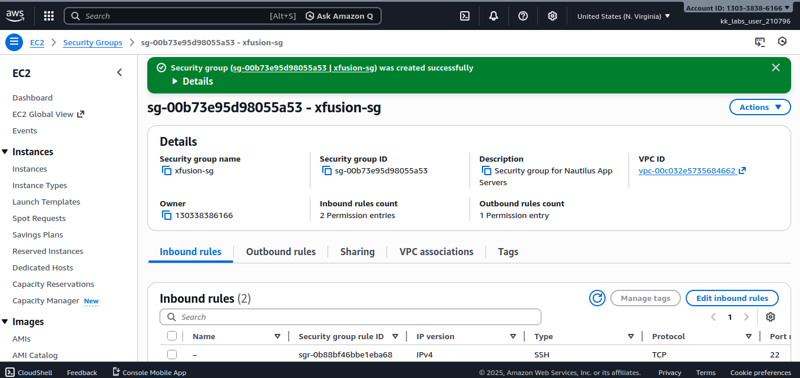

# Day-2
# Day 2/100

## Task
The Nautilus DevOps team is strategizing the migration of a portion of their infrastructure to the AWS cloud. Recognizing the scale of this undertaking, they have opted to approach the migration in incremental steps rather than as a single massive transition. To achieve this, they have segmented large tasks into smaller, more manageable units. This granular approach enables the team to execute the migration in gradual phases, ensuring smoother implementation and minimizing disruption to ongoing operations. By breaking down the migration into smaller tasks, the Nautilus DevOps team can systematically progress through each stage, allowing for better control, risk mitigation, and optimization of resources throughout the migration process.

**Task Requirement:**  
Create a security group under the default VPC with the following specifications:  
- Name: `datacenter-sg`  
- Description: `Security group for Nautilus App Servers`  
- Inbound rules:  
  - HTTP, port 80, source `0.0.0.0/0`  
  - SSH, port 22, source `0.0.0.0/0`  

---

## Task Description
Today, I created a **security group** named `datacenter-sg` in the default VPC.  
I added inbound rules for **HTTP (port 80)** and **SSH (port 22)**, allowing public access for testing and secure remote connections. This task helped me understand how to control traffic to EC2 instances using AWS security groups.

---

## Key Feature
**Security Group** – A security group acts as a virtual firewall for EC2 instances. It controls **inbound and outbound traffic** at the instance level. Key points:  
- Allows specific protocols (HTTP, SSH, etc.)  
- Can define port ranges and source IP addresses  
- Rules are stateful: if traffic is allowed in, it’s automatically allowed out  

---

## Key Takeaway
Security groups are a fundamental part of AWS networking. They protect instances while allowing only necessary access, teaching how to manage traffic securely in the cloud.

---

## Screenshot
_Seccessful creation of Security Group:_  

---

_Exercise Completed:_   

