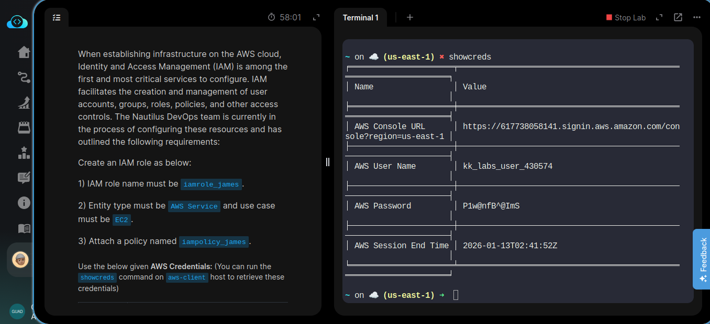
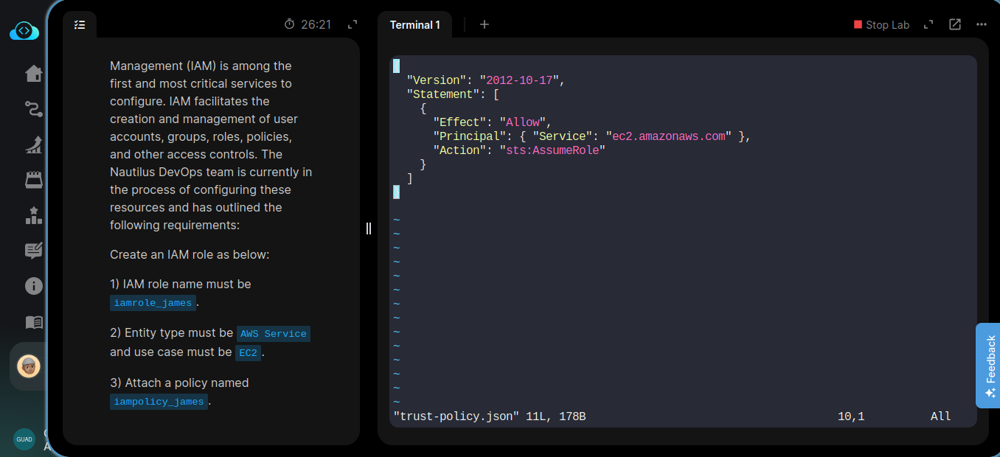
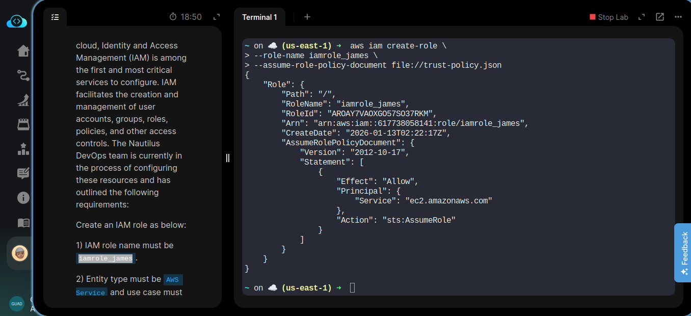
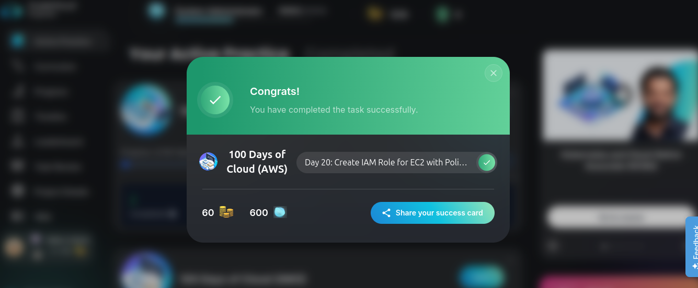

# Day 20/100 — Creating an IAM Role with EC2 Trust Policy

## Task Description
When establishing infrastructure on the AWS cloud, Identity and Access Management (IAM) is among the first and most critical services to configure. IAM facilitates the creation and management of user accounts, groups, roles, policies, and other access controls. The Nautilus DevOps team is currently in the process of configuring these resources and has outlined the following requirements:

Create an IAM role as below:

1) IAM role name must be iamrole_james.

2) Entity type must be AWS Service and use case must be EC2.

3) Attach a policy named iampolicy_james.


Use the below given AWS Credentials: (You can run the showcreds command on aws-client host to retrieve these credentials)
Console URL https://274233372499.signin.aws.amazon.com/console?region=us-east-1
Username kk_labs_user_234250
Password G2h4zWXpKWKM
Start Time Tue Jan 13 10:03:10 UTC 2026
End Time Tue Jan 13 11:03:10 UTC 2026


Notes:

    Create the resources only in us-east-1 region.

    To display or hide the terminal of the AWS client machine, you can us make a ready command to completethis

---

## What I Learned
- Creating IAM roles for AWS services
- Configuring trust policies for EC2
- Attaching policies to roles
- Using AWS CLI for IAM management

---

## Technical Terms
- **IAM Role**: An AWS identity with permissions that can be assumed by entities
- **Trust Policy**: Defines which services can assume the role
- **IAM Policy**: JSON document defining permissions
- **EC2**: Amazon Elastic Compute Cloud service
- **ARN**: Amazon Resource Name - unique identifier for AWS resources
- **Principal**: Entity allowed to perform actions in a policy
- **STS**: Security Token Service - handles temporary credentials

---

## Commands Used

### Step 1: Create Trust Policy Document
First, I created a JSON trust policy document that allows EC2 to assume the role:

```json
{
    "Version": "2012-10-17",
    "Statement": [
        {
            "Effect": "Allow",
            "Principal": {
                "Service": "ec2.amazonaws.com"
            },
            "Action": "sts:AssumeRole"
        }
    ]
}
```

**Explanation**: This trust policy defines which service (EC2) is allowed to assume this role. The Principal specifies the EC2 service, and the Action "sts:AssumeRole" grants permission to assume the role.

### Step 2: Create the IAM Role
```bash
aws iam create-role --role-name iamrole_james --assume-role-policy-document file://trust-policy.json
```

**Command Breakdown**:
- `aws iam create-role`: Creates a new IAM role
- `--role-name iamrole_james`: Specifies the name of the role to create
- `--assume-role-policy-document file://trust-policy.json`: Points to the JSON file containing the trust policy

### Step 3: Create the IAM Policy
```bash
aws iam create-policy --policy-name iampolicy_james --policy-document file://policy.json
```

**Command Breakdown**:
- `aws iam create-policy`: Creates a new IAM policy
- `--policy-name iampolicy_james`: Specifies the name of the policy to create
- `--policy-document file://policy.json`: Points to the JSON file containing the permissions policy

### Step 4: Attach the Policy to the Role
```bash
aws iam attach-role-policy --role-name iamrole_james --policy-arn arn:aws:iam::274233372499:policy/iampolicy_james
```

**Command Breakdown**:
- `aws iam attach-role-policy`: Attaches a policy to an IAM role
- `--role-name iamrole_james`: Specifies the role to attach the policy to
- `--policy-arn arn:aws:iam::274233372499:policy/iampolicy_james`: Specifies the ARN of the policy to attach

---

## Key Steps
1. Created trust policy allowing EC2 to assume the role
2. Created IAM role `iamrole_james` with EC2 trust policy
3. Created IAM policy `iampolicy_james`
4. Attached the policy to the role

---

## Screenshots

_Task details:_


_Trust policy JSON:_


_Created IAM role and assume policy:_


_Congratulations on completion:_
