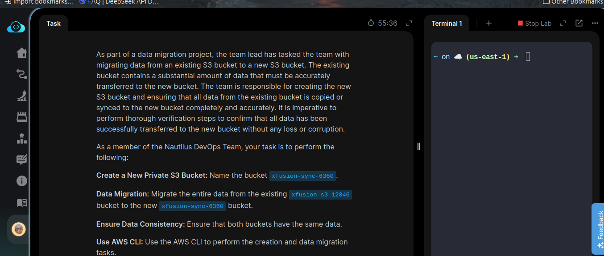
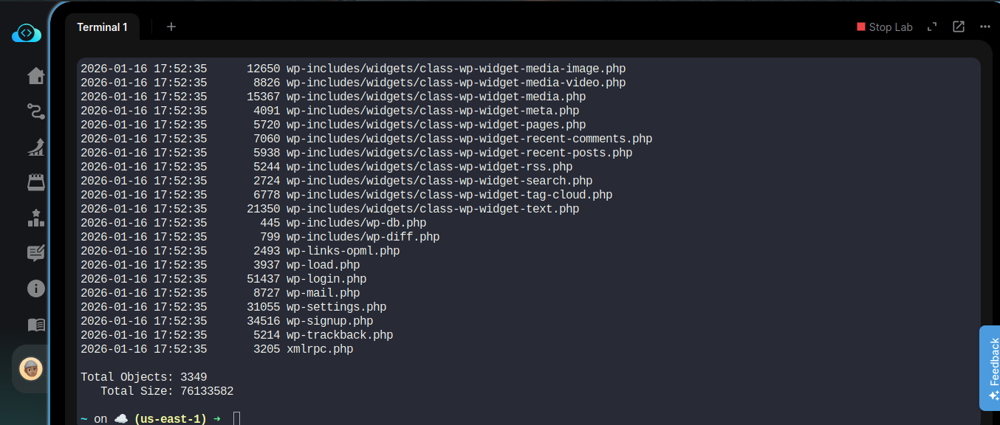
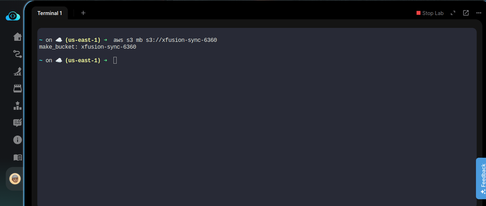
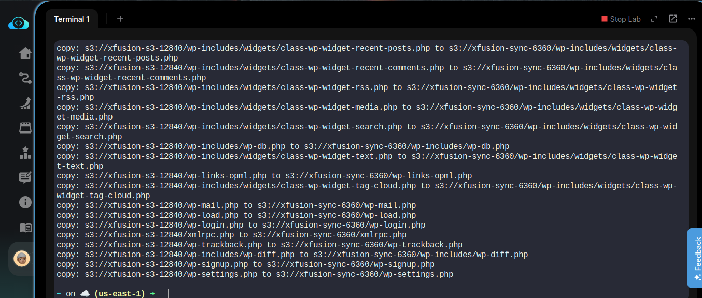
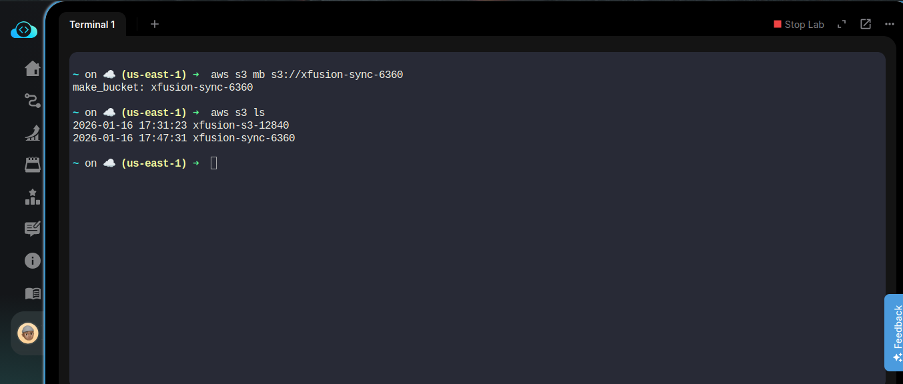
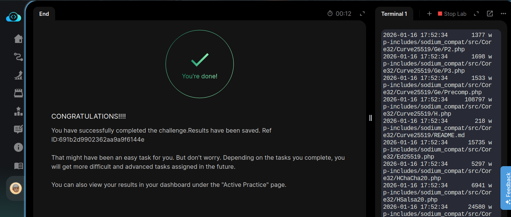

# Day 23/100 — S3 Data Migration: Syncing Data Between S3 Buckets

## Task Overview
Migrate data from existing S3 bucket `xfusion-s3-12840` to new bucket `xfusion-sync-6360` using AWS CLI.

## Important Terms
- **S3 Bucket**: A container for objects stored in Amazon S3
- **AWS CLI**: Command-line interface for interacting with AWS services
- **Sync Operation**: Copies files between locations while maintaining synchronization
- **Recursive Flag**: Includes all subdirectories and nested objects in the operation

## Why Use Recursive?
The `--recursive` flag is essential because S3 buckets often contain nested folders and multiple objects. Without this flag, `aws s3 ls` would only list top-level objects, potentially missing important data in subdirectories. Using `--recursive` ensures we see and verify all objects during migration.

## Prerequisites
- AWS CLI installed and configured
- Valid AWS credentials with S3 permissions

## Step-by-Step Instructions

### Step 1: Create New S3 Bucket
```bash
aws s3 mb s3://xfusion-sync-6360
```

### Step 2: Verify Source Bucket Contents
```bash
aws s3 ls s3://xfusion-s3-12840 --recursive
```

### Step 3: Sync Data to New Bucket
```bash
aws s3 sync s3://xfusion-s3-12840 s3://xfusion-sync-6360
```

### Step 4: Verify Destination Bucket Contents
```bash
aws s3 ls s3://xfusion-sync-6360 --recursive
```

### Step 5: Confirm Data Consistency
```bash
# Count objects in both buckets to ensure they match
echo "Source objects:" && aws s3 ls s3://xfusion-s3-12840 --recursive | wc -l
echo "Destination objects:" && aws s3 ls s3://xfusion-sync-6360 --recursive | wc -l

# Perform dry run to confirm no differences
aws s3 sync s3://xfusion-s3-12840 s3://xfusion-sync-6360 --dryrun
```

## Key Commands Summary
- `aws s3 mb s3://bucket-name` - Create bucket
- `aws s3 sync source dest` - Copy all data between buckets
- `aws s3 ls s3://bucket-name --recursive` - List all objects
- `aws s3 sync source dest --dryrun` - Preview sync without changes

## Expected Outcome
All data from `xfusion-s3-12840` should be accurately copied to `xfusion-sync-6360` with identical content.

## Troubleshooting
- If getting permission errors, verify your AWS credentials and IAM permissions
- If bucket name exists, choose a unique name (S3 bucket names must be globally unique)
- For large datasets, sync operation may take several minutes to complete

## Screenshots

### Task Details


### Old S3 Bucket View


### New Bucket Created


### Migration Applied Successfully


### All S3 Buckets View


### Task Completion
