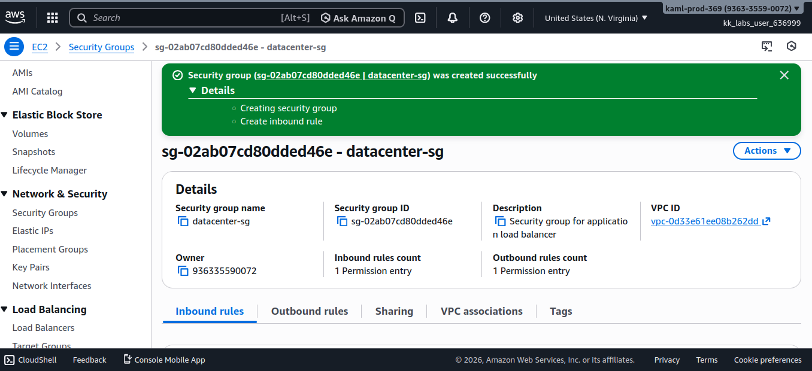
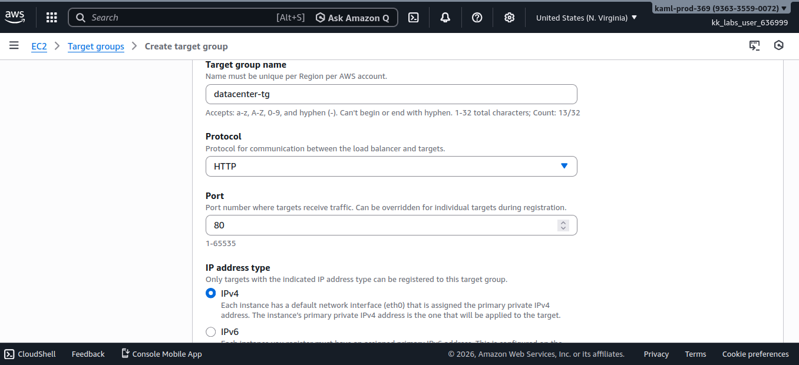
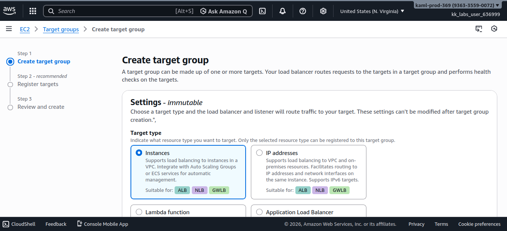
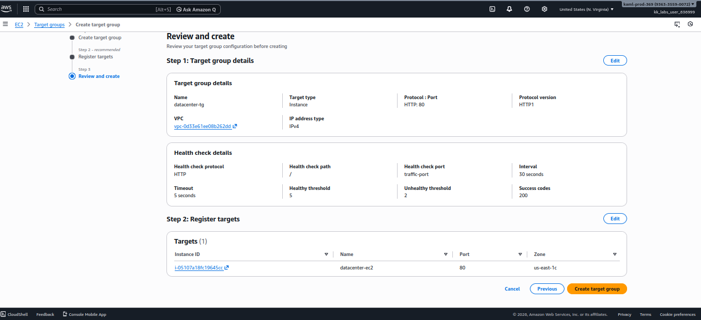
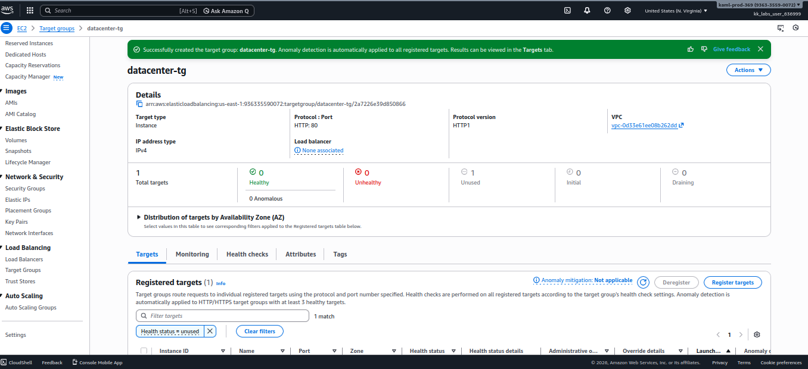
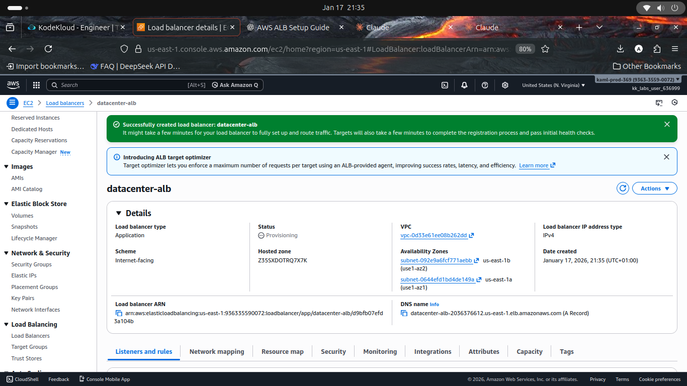
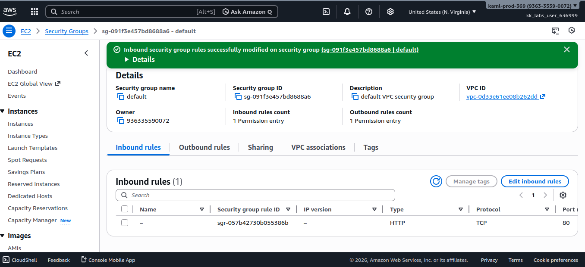
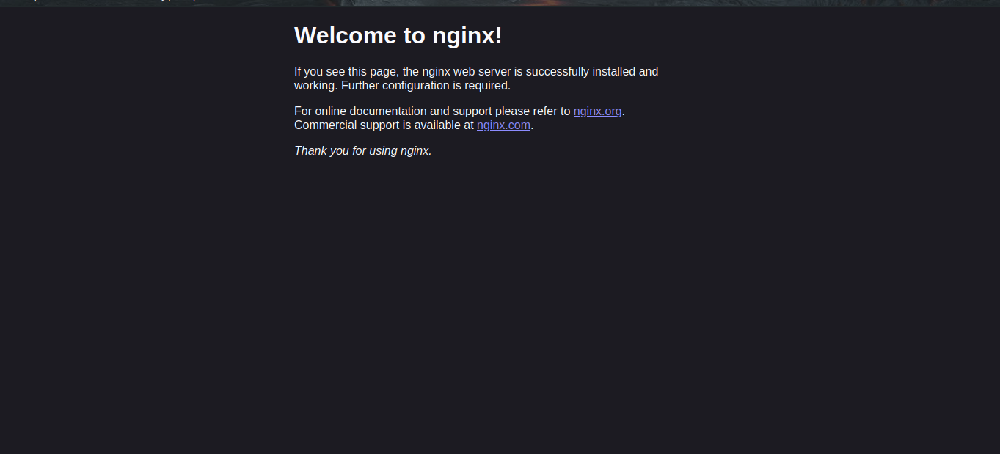
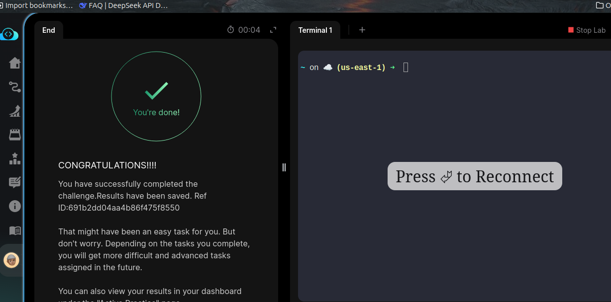

# Day 24/100 — AWS Application Load Balancer Setup: Creating ALB with Target Group and Security Groups

## Task Overview
Set up an Application Load Balancer (ALB) in front of an EC2 instance running Nginx. The ALB will route traffic on port 80 to the Nginx server, which currently serves a sample page but will host the actual application later.

## Important Terms
- **Application Load Balancer (ALB)**: AWS service that distributes incoming application traffic across multiple targets, such as EC2 instances
- **Target Group**: Collection of registered targets (EC2 instances) that receive traffic from the load balancer
- **Security Group**: Virtual firewall that controls inbound and outbound traffic for AWS resources
- **EC2 Instance**: Virtual server in the AWS cloud
- **Nginx**: High-performance web server and reverse proxy server

## Why Use Application Load Balancer?
An Application Load Balancer is essential for distributing traffic across multiple instances, improving availability and fault tolerance. It operates at Layer 7 (HTTP/HTTPS) and can route requests based on content, making it ideal for web applications. The ALB also provides health checks to ensure traffic is only sent to healthy instances.

## Prerequisites
- AWS account with appropriate permissions
- EC2 instance with Nginx server running
- Basic understanding of AWS networking concepts
- Access to AWS Management Console

## Step-by-Step Instructions

### Step 1: Create Security Group for ALB
1. Navigate to the EC2 dashboard in AWS Console
2. Click on "Security Groups" in the left sidebar
3. Click "Create security group"
4. Enter the name `devops-sg`
5. Add an inbound rule allowing HTTP (port 80) traffic from anywhere (0.0.0.0/0)
6. Select the appropriate VPC and click "Create security group"

### Step 2: Create Target Group
1. Navigate to the EC2 Load Balancers section in AWS Console
2. Click on "Target Groups" in the left sidebar
3. Click "Create target group"
4. Choose "Instances" as the target type
5. Set the target group name to `devops-tg`
6. Set protocol to HTTP and port to 80
7. Select the appropriate VPC
8. Click "Create"

### Step 3: Register EC2 Instance with Target Group
1. After creating the target group, select it from the list
2. Click on the "Targets" tab
3. Click "Edit" or "Register targets"
4. Select your EC2 instance (`devops-ec2`)
5. Click "Include as pending" and then "Save"

### Step 4: Create Application Load Balancer
1. In the EC2 Load Balancers section, click on "Load Balancers"
2. Click "Create Load Balancer"
3. Select "Application Load Balancer"
4. Fill in the details:
   - Name: `devops-alb`
   - Scheme: Internet-facing
   - IP address type: IPv4
   - Select at least 2 Availability Zones
   - Assign security groups: Select `devops-sg`
5. Click "Next"

### Step 5: Configure Listeners and Routing
1. On the "Configure listeners" page:
   - Protocol: HTTP
   - Port: 80
   - Default action: Forward to `devops-tg`
2. Click "Next" and then "Create" to create the ALB

### Step 6: Configure EC2 Instance Security Group
1. Go back to the "Security Groups" section
2. Find and select the security group attached to your EC2 instance
3. Click on the "Inbound rules" tab
4. Add a rule to allow HTTP (port 80) traffic from the ALB's security group (`devops-sg`)
5. Save the changes

## Key Console Actions Summary
- EC2 → Security Groups → Create security group - Create security group for ALB
- EC2 → Target Groups → Create target group - Create target group for instances
- EC2 → Target Groups → Register targets - Register EC2 instance with target group
- EC2 → Load Balancers → Create Load Balancer - Create Application Load Balancer
- EC2 → Load Balancers → Configure listeners - Route traffic to target group

## Expected Outcome
The Application Load Balancer should be accessible via its DNS name, routing traffic to the Nginx server on the EC2 instance. The Nginx page should be displayed when accessing the ALB's URL.

## Troubleshooting
- If the ALB is not accessible, verify that the security groups allow traffic on port 80
- Check that the target group has healthy registered targets
- Ensure the EC2 instance's security group allows inbound traffic from the ALB
- Verify that Nginx is running and listening on port 80 on the EC2 instance
- Confirm that subnets used for ALB are public subnets with Internet Gateway attached

## Screenshots

### Security Group Created

### Creating Target Group

### Creating Target Group (Alternative View)

### Target Group Creation Details

### Completed Target Group

### Successfully Created ALB

### Modified Inbound Rules for Default Security Group

### Nginx Page Accessible Through ALB

### Task Completion Congratulations
