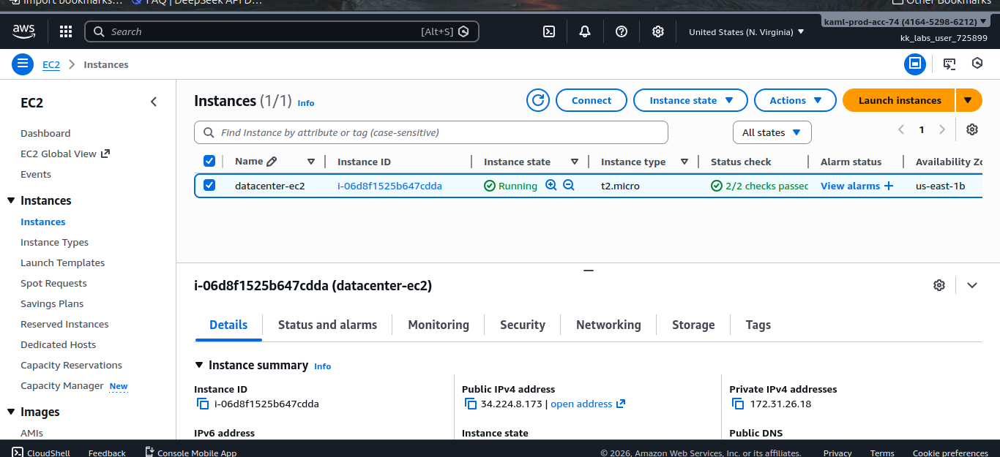
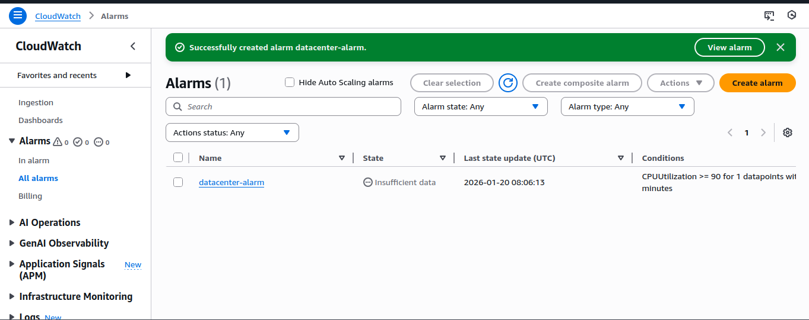
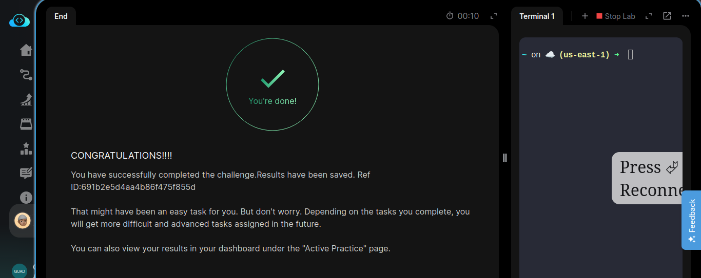
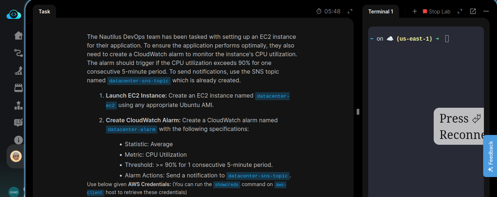

# Day 25: Setting Up EC2 Instance with CloudWatch Monitoring

## Overview
Today's task involved setting up an EC2 instance for the Nautilus application and configuring a CloudWatch alarm to monitor CPU utilization. This ensures optimal application performance through proactive monitoring.

## Objectives
- Launch an EC2 instance named `nautilus-ec2` using Ubuntu AMI
- Configure a CloudWatch alarm named `nautilus-alarm` to monitor CPU utilization
- Set up notifications via SNS topic `nautilus-sns-topic`

## Steps Performed

### 1. Launch EC2 Instance
- Created an EC2 instance named `nautilus-ec2`
- Selected an appropriate Ubuntu AMI
- Configured instance with necessary security groups and IAM roles

### 2. Configure CloudWatch Alarm
- Created CloudWatch alarm named `nautilus-alarm`
- Set metric to CPU Utilization
- Configured statistic to Average
- Set threshold to >= 90%
- Configured alarm to trigger after 1 consecutive 5-minute period
- Set alarm action to send notifications to `nautilus-sns-topic`

### 3. Verification
- Verified EC2 instance is running properly
- Confirmed CloudWatch alarm is active and monitoring
- Tested notification mechanism via SNS topic

## Technical Details

### CloudWatch Alarm Configuration
- **Metric**: CPUUtilization
- **Statistic**: Average
- **Period**: 5 minutes
- **Evaluation Periods**: 1
- **Threshold**: >= 90%
- **Alarm Action**: Send notification to `nautilus-sns-topic`

## Screenshots

### EC2 Instance Created

### CloudWatch Alarm Configured

### Task Completion Verification

### Task Details View

## Key Learnings
- Importance of proactive monitoring for application performance
- Setting up automated alerts for infrastructure metrics
- Integration between CloudWatch alarms and SNS for notifications
- Proper threshold configuration to avoid false positives

## AWS Services Used
- Amazon EC2
- Amazon CloudWatch
- Amazon SNS

## Conclusion
Successfully deployed the EC2 instance with proper monitoring in place. The CloudWatch alarm will alert the team if CPU utilization exceeds 90%, allowing for timely intervention to maintain application performance.