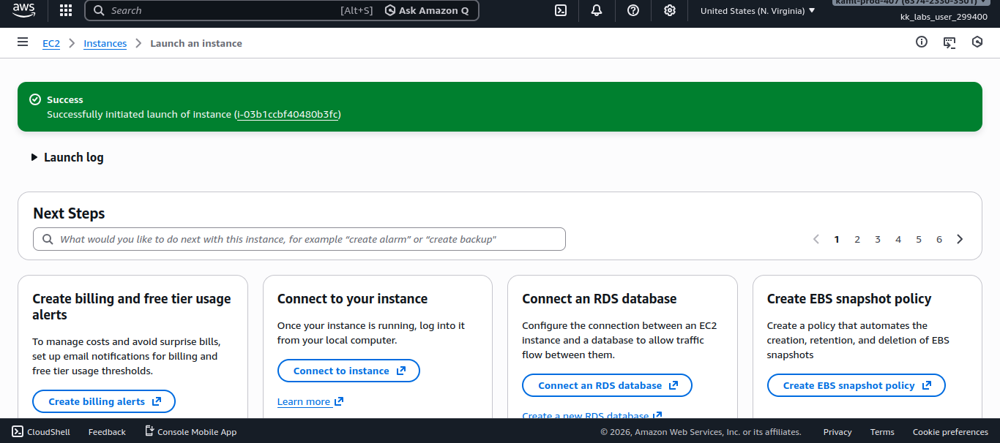
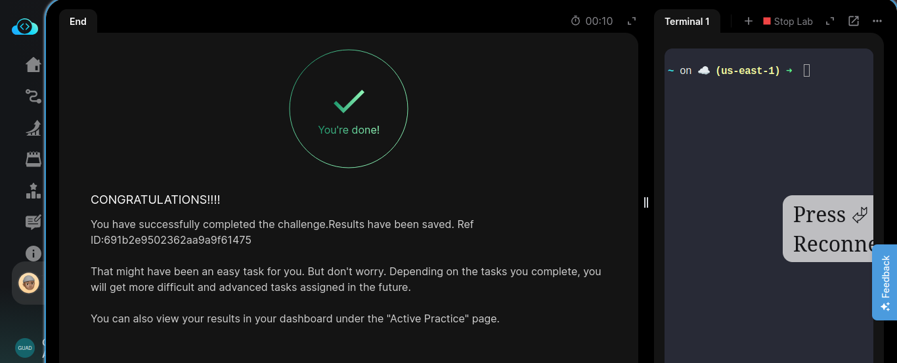

# Day 26/100 — AWS EC2 Web Server Setup: Creating EC2 Instance with Nginx Web Server

## Task Overview
Set up an EC2 instance that will serve as a web server using Nginx. This instance will be part of the initial infrastructure setup for the Nautilus project. The server needs to be correctly configured and accessible from the internet for the upcoming deployment phase.

## Important Terms
- **EC2 Instance**: Virtual server in the AWS cloud
- **Nginx**: High-performance web server and reverse proxy server
- **User Data Script**: Script that runs during instance launch to automate configuration
- **Security Group**: Virtual firewall that controls inbound and outbound traffic for AWS resources
- **AMI**: Amazon Machine Image - template for creating EC2 instances
- **Ubuntu**: Linux distribution used for this instance

## Why Use EC2 with Nginx?
Amazon EC2 provides scalable computing capacity in the AWS cloud. Using Nginx as a web server offers high performance, stability, and low resource consumption. Setting up an EC2 instance with Nginx creates the foundation for hosting web applications with reliable performance and scalability.

## Prerequisites
- AWS account with appropriate permissions
- AWS credentials for accessing the console
- Basic understanding of AWS networking concepts
- Access to AWS Management Console

## Step-by-Step Instructions

### Step 1: Prepare User Data Script
1. Create a script that will install and configure Nginx during instance launch
2. The script should include:
   ```
   #!/bin/bash
   apt update
   apt install -y nginx
   systemctl start nginx
   systemctl enable nginx
   ```

### Step 2: Create Security Group for EC2 Instance
1. Navigate to the EC2 dashboard in AWS Console
2. Click on "Security Groups" in the left sidebar
3. Click "Create security group"
4. Enter the name `xfusion-web-sg`
5. Add an inbound rule allowing HTTP (port 80) traffic from anywhere (0.0.0.0/0)
6. Add an inbound rule allowing SSH (port 22) traffic from your IP address
7. Select the appropriate VPC and click "Create security group"

### Step 3: Launch EC2 Instance
1. Navigate to the EC2 dashboard in AWS Console
2. Click on "Instances" in the left sidebar
3. Click "Launch Instance"
4. Fill in the instance details:
   - Name: `xfusion-ec2`
   - AMI: Select Ubuntu Server 20.04 LTS or newer
   - Instance Type: t2.micro (or free tier eligible)
   - Key Pair: Select existing or create new key pair
   - Network Settings: Select the security group created in Step 2

### Step 4: Configure User Data
1. In the "Advanced details" section of the launch instance wizard
2. Paste the user data script from Step 1 in the "User data" field
3. This script will automatically install and start Nginx when the instance launches

### Step 5: Launch the Instance
1. Review all settings
2. Click "Launch instance"
3. Wait for the instance to reach "Running" state

### Step 6: Verify Nginx Installation
1. Once the instance is running, copy the Public IP address
2. Open a web browser and navigate to the Public IP address
3. You should see the default Nginx welcome page

## Key Console Actions Summary
- EC2 → Security Groups → Create security group - Create security group for web server
- EC2 → Instances → Launch Instance - Launch EC2 instance with Ubuntu AMI
- EC2 → Instances → Configure User Data - Add script to install and start Nginx
- EC2 → Instances → Launch - Launch the configured instance
- Browser → Navigate to Public IP - Verify Nginx is running

## Expected Outcome
The EC2 instance named `xfusion-ec2` should be running with Nginx installed and accessible via its public IP address. The default Nginx welcome page should be displayed when accessing the instance's public IP.

## Troubleshooting
- If the Nginx page is not accessible, verify that the security group allows traffic on port 80
- Check that the user data script executed properly by connecting via SSH and running `sudo systemctl status nginx`
- Ensure the instance has a public IP address assigned
- Verify that the instance is in a public subnet with Internet Gateway attached
- Check the instance system logs in the EC2 console for any errors during boot

## Screenshots

### EC2 Instance Successfully Launched


### Task Completion Confirmation
