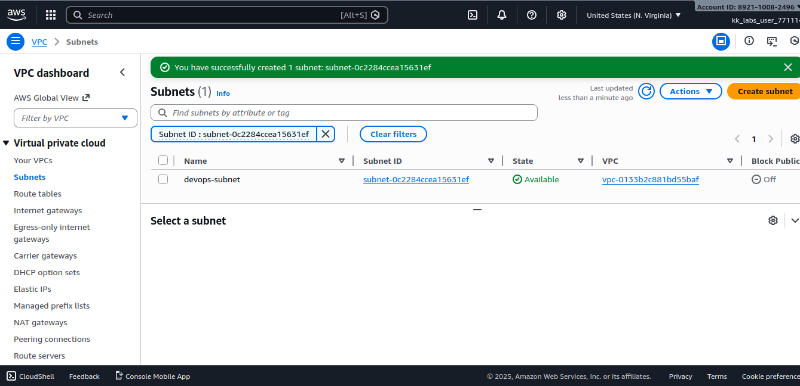
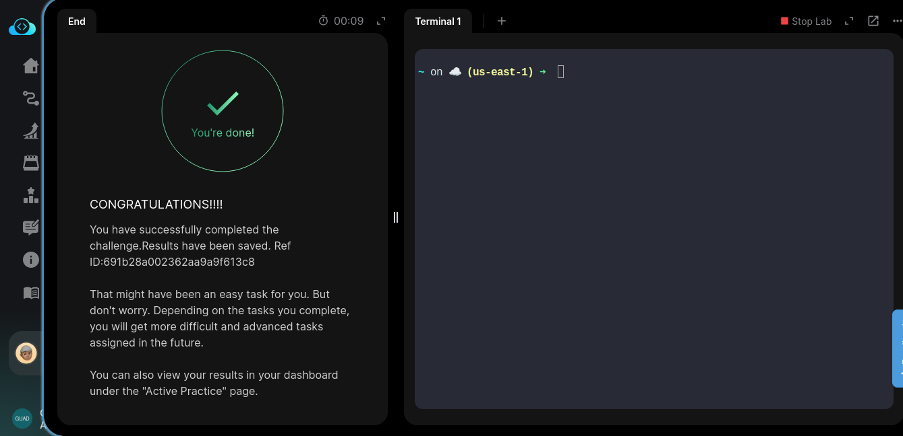
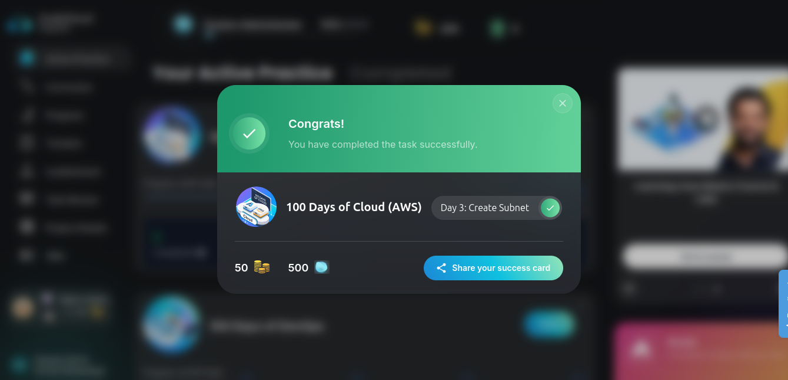
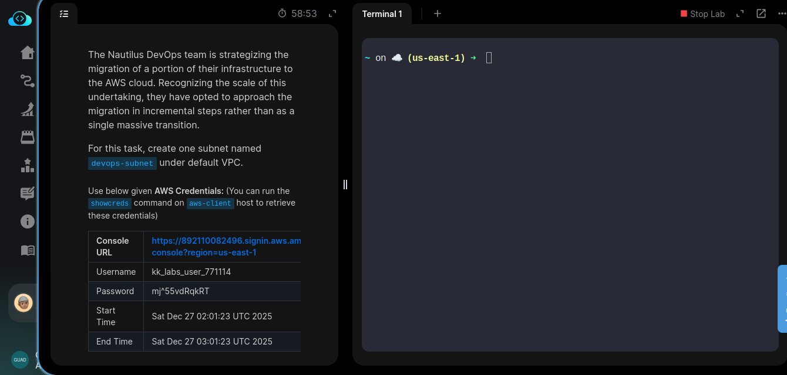

# Day 3/100

## Task
The Nautilus DevOps team is strategizing the migration of a portion of their infrastructure to the AWS cloud. Recognizing the scale of this undertaking, they have opted to approach the migration in incremental steps rather than as a single massive transition.

**Task Requirement:**  
Create a subnet under the default VPC with the following specifications:  
- Name: `devops-subnet`  

---

## Task Description
Today, I created a **subnet** named `devops-subnet` under the default VPC.  
This task helped me practice organizing cloud resources into smaller network segments, which is crucial for managing and isolating workloads effectively.

---

## Key Feature
**Subnet** – A subnet is a **smaller network segment within a VPC**.  
Key points:  
- Allows logical separation of resources  
- Improves security and traffic management  
- Enables better organization of cloud resources for scaling and management  

---

## Key Takeaway
Breaking a VPC into subnets helps structure cloud networks, making them more manageable, secure, and scalable. This is a foundational networking skill in AWS.

---

## Screenshot
_Subnet Created Successfully:_  

---

_Exercise Completed:_   

---
_Shoutout picture:_

---

_Task_detail_screenshot:_
 

