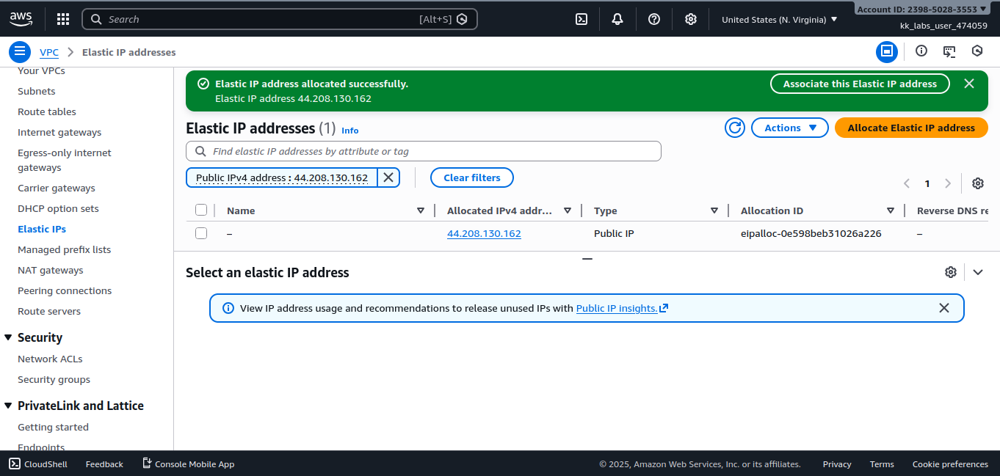
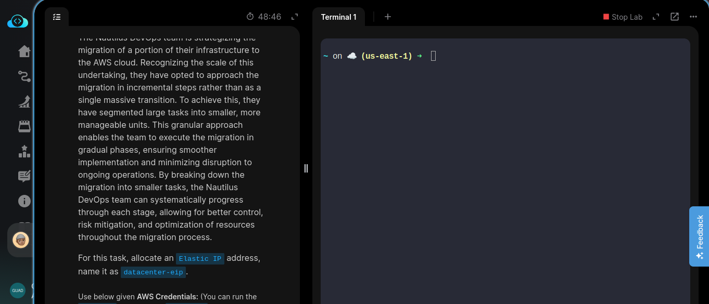
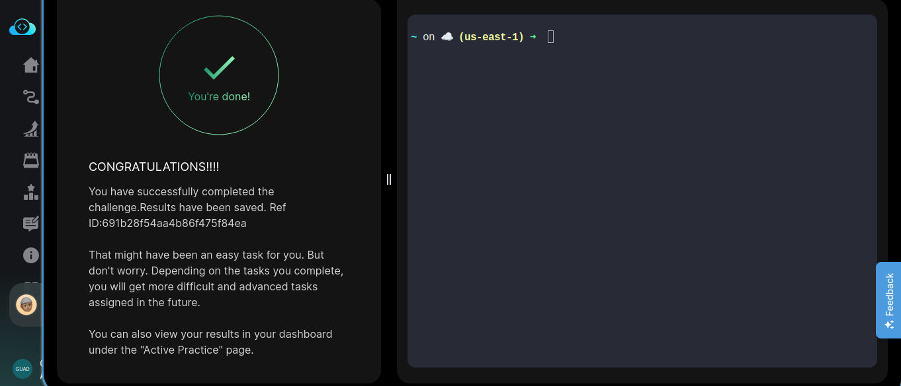

# Day 4/100

## Task
The Nautilus DevOps team is strategizing the migration of a portion of their infrastructure to the AWS cloud. Recognizing the scale of this undertaking, they have opted to approach the migration in incremental steps rather than as a single massive transition. To achieve this, they have segmented large tasks into smaller, more manageable units. This granular approach enables the team to execute the migration in gradual phases, ensuring smoother implementation and minimizing disruption to ongoing operations. By breaking down the migration into smaller tasks, the Nautilus DevOps team can systematically progress through each stage, allowing for better control, risk mitigation, and optimization of resources throughout the migration process.

**Task Requirement:**  
Allocate an Elastic IP address and name it `datacenter-eip`.

---

## Task Description
Today, I allocated an **Elastic IP (EIP)** named `datacenter-eip`.  
At first, I struggled to clearly understand the difference between **public IPs** and **Elastic IPs**. I spent time reading documentation, searching online, and trying different options in the AWS console before it finally clicked.

---

## Key Feature
**Elastic IP (EIP)** – An Elastic IP is a **static public IPv4 address** provided by AWS.

Key characteristics:
- Remains the same even if the instance is stopped and started
- Can be reattached to another instance if needed
- Useful for production systems that require a stable public IP

---

## Key Takeaway
Elastic IPs teach an important cloud concept: **infrastructure is flexible**.  
Instead of depending on fixed physical servers, cloud resources can change while keeping the same public access point. Learning this required experimentation, mistakes, and research, which made the lesson stick.

---

## Screenshot
_Successful allocation of Elastic IP :_  

---

_Task Detail :_

---
_Completion:_
