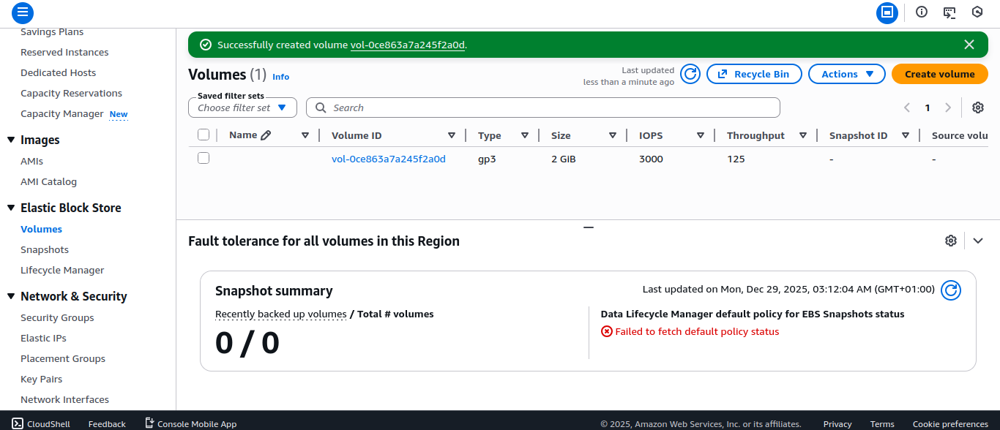
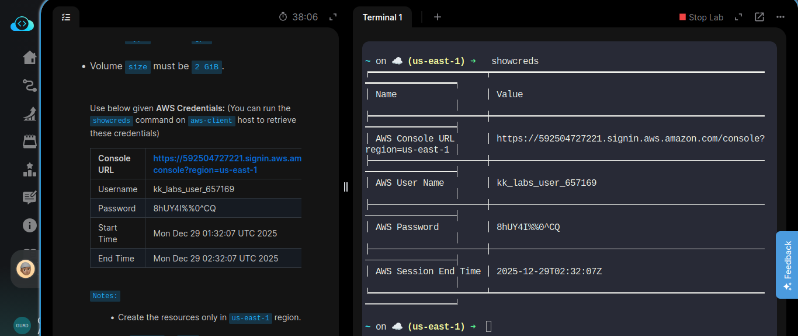

# Day 5/100

## Task
The Nautilus DevOps team is strategizing the migration of a portion of their infrastructure to the AWS cloud. Recognizing the scale of this undertaking, they have opted to approach the migration in incremental steps rather than as a single massive transition. To achieve this, they have segmented large tasks into smaller, more manageable units. This granular approach enables the team to execute the migration in gradual phases, ensuring smoother implementation and minimizing disruption to ongoing operations. By breaking down the migration into smaller tasks, the Nautilus DevOps team can systematically progress through each stage, allowing for better control, risk mitigation, and optimization of resources throughout the migration process.

**Task Requirement:**  
Create an EBS volume with the following specifications:
- Name: `xfusion-volume`
- Type: `gp3`
- Size: `2 GiB`

---

## Task Description
Today, I created an **EBS volume** named `xfusion-volume` using the **gp3** volume type with a size of **2 GiB**.  
Initially, I was confused about the differences between EBS volume types such as **gp2, gp3, and io1**. I spent time reading documentation, searching online, and comparing use cases before understanding why gp3 is often preferred.

This task helped me understand how storage is provisioned and managed separately from compute in the cloud.

---

## Key Feature
**EBS (Elastic Block Store) – GP3 Volume**

Key points:
- Provides persistent block-level storage for EC2 instances
- `gp3` offers better performance control at a lower cost compared to `gp2`
- Storage remains intact even if the EC2 instance is stopped or terminated

---

## Key Takeaway
Cloud storage is flexible and independent of compute resources. Creating and managing EBS volumes showed me how storage can be scaled, optimized, and reused without being tied to a single server. Learning this required research and hands-on experimentation, which strengthened my understanding.

---

## Screenshot
_Successfully created volume:_  

---
_Detail:_

